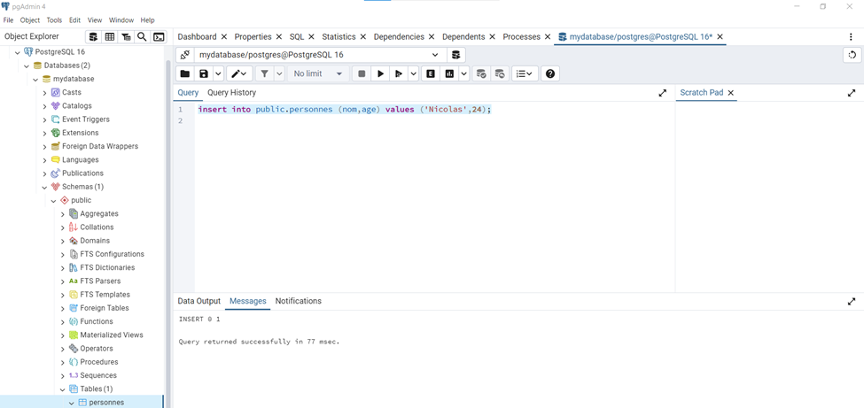

# CRUDApplication

Demarche:
1)We created DB server Postgresql16\
2)we installed  pgadmin tool a DB IDE tool in order to make SQL statements. This DB server is listening on port 5432.

3)We installed the intellij IDE in order to construct our code.\
4)We installed openJDK23 

5)In order to make sql statements with the db we need add a specific driver for this postgresql db to our java project.By doing this:

